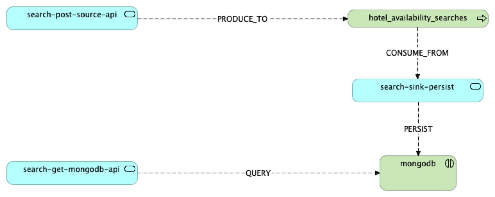

# Hotel App

## Table of contents

- [General info](#general-info)
- [Domains](#domains)
- [Methodologies](#methodologies)
- [Technologies](#technologies)
- [Screenshots](#screenshots)
- [Setup](#setup)
- [Usage](#usage)
- [Features](#features)
- [Questions](#questions)
- [Project Status](#project-status)
- [To Do](#to-do)
- [About Owner](#about-owner)
- [License](#license)

## General info

Hotel application to get availability.



## Domains

- availability

## Methodologies

- Contract first
- Api first
- BDD
- TDD

## Technologies

Project is created with technology:version

- OpenApi: 3.0.0
- Docker-compose: 3.8
- Kafka:
- Zookeeper:
- Schema-Registry:
- MongoDB: 4.9
- Maven: 3.9.0
    - core projects
    - archetypes
- Java: 17
- Spring:
- Gherkin
- Archimate

## Screenshots

...

## Setup

`runEnv.sh` script:

- Run docker environment with containers below:
    - Kafka
    - Schema-Registry
    - MongoDB

```
$ ./runEnv.sh
```

`registry.sh` script:

- generates avros from idls
- set topics compatibility to `FULL_TRANSITIVE`
- register topics on schema-registry

`stopEnv.sh` script:

- Stops docker environment

```
$ ./stopEnv.sh
```

## Modules

- [node-js-swagger-mock-server](nodejs-swagger-mock-server) -> [README.md](nodejs-swagger-mock-server/README.md)

## Usage

To run Swagger Mock Server see [README.md](nodejs-swagger-mock-server/README.md).

You can also import [OpenApi file](api/HotelAvailability-1.0.0-swagger.yaml) to postman API.

## Features

- save searches
    - when POST /search with "search" json body
        - returns generated UUID searchId
        - produce "search" message onto `hotel_availability_searches` topic
- persist searches into MongoDb
    - when there is new messages on `hotel_availability_searches` then persists them to MongoDb
- retrieve searches by id with count of similar searches

## Acceptance Criteria -> Scenarios

<details><summary>availability_search_post_example1_body</summary>

``` json
{
  "hotelId": "1234aBc",
  "checkIn": "29/12/2023",
  "checkOut": "31/12/2023",
  "ages": [3, 29, 30, 1]
}
```

</details>
<details><summary>availability_search_post_example2_body</summary>

``` json
{
  "hotelId": "otherDummyHotelId",
  "checkIn": "29/12/2023",
  "checkOut": "31/12/2023",
  "ages": [3, 29, 30, 1]
}
```

</details>
<details><summary>availability_search_post_callback_pattern</summary>

``` json
{
  "id": "^[0-9a-fA-F]{8}-[0-9a-fA-F]{4}-[0-9a-fA-F]{4}-[0-9a-fA-F]{4}-[0-9a-fA-F]{12}$"
}
```

</details>
<details><summary>availability_search_get_example1_response</summary>

``` json
{
  "searchId": "88454af7-1a87-49c7-9622-f66635665fed",
  "search": {
    "hotelId": "1234aBc",
    "checkIn": "29/12/2023",
    "checkOut": "31/12/2023",
    "ages": [3, 29, 30, 1]
  },
  "count": 3
}
```

</details>
<details><summary>availability_search_get_example2_response</summary>

``` json
{
  "searchId": "88454af7-1a87-49c7-9622-f66635665fed",
  "search": {
    "hotelId": "otherDummyHotelId",
    "checkIn": "29/12/2023",
    "checkOut": "31/12/2023",
    "ages": [3, 29, 30, 1]
  },
  "count": 1
}
```

</details>

- save a well formatted availability search to `POST /search` <ins>*<availability_search_post_example1_body>*</ins>
    - returns `HTTP 201` created
    - returns generated id (UUID format) <ins>*<availability_search_post_callback_pattern>*</ins>
    - consulting `GET /search` with returned id will return search with count 1 <ins>*<
      availability_search_get_example1_response>*</ins>
- save an empty availability search to `POST /search`
    - returns `HTTP 400` bad-request
- save an incompatible availability search to `POST /search`
    - returns `HTTP 400` bad-request
- save a well formatted availability search 3 times to `POST /search` and other availability search once
  <ins>*3\*<availability_search_post_example1_body> + 1\*<availability_search_post_example2_body>*</ins>
    - always returns `HTTP 201` created
    - returns different generated ids (UUID format)
    - consulting `GET /search` with returned ids of first search will return search with count 3
      <ins>*<availability_search_get_example1_response>*</ins>
    - consulting `GET /search` with returned id of second search will return search with count 1
      <ins>*<availability_search_get_example2_response>*</ins>

## Questions

- save searches
    - fields validation:
        - which fields are nullable?
        - hotelId format
        - should have "checkIn" and "checkOut" date format validation?
            - can be checkIn after checkOut?
        - max and min ages
- persist searches into MongoDb
- retrieve searches by id with count of similar searches:
    - Endpoint `GET /search`
        - can be 'searchId' pathParam instead queryParam?
        - if 'searchId' not exists returns 404 error or empty 'search' field with 'count' field as 0?
- which audit fields are required
- should application errors be registered on any topic?

## Project Status

**In Progress**

## To Do

1. microservices archetypes
    1. kafka-sink-persist
    2. kafka-source-api
    3. mongodb-api
2. archetypes parents
    1. kafka-sink-persist
    2. kafka-source-api
    3. mongodb-api
3. module search-post-api
    1. acceptance tests with cucumber
    2. module code
4. module search-get-api
    1. acceptance tests with cucumber
    2. module code
5. module search-sink-persist
    1. acceptance tests with cucumber
    2. module code
6. versioning
7. Gradle
8. Quarkus & Kubernetes
9. Sonarqube validation (docker/server)
10. performance charts

## About Owner

Created by:

- [@javierddn](https://www.linkedin.com/in/javierdediegonavarro)
    - Github: https://github.com/javierddn
    - LinkedIn: https://www.linkedin.com/in/javierdediegonavarro
    - DockerHub: https://hub.docker.com/u/javierddn
    - Bitbucket: https://bitbucket.org/javierddn
    - Gitlab: https://gitlab.com/javierddn
    - TravisCI: https://app.travis-ci.com/github/javierddn
    - CircleCI: https://app.circleci.com/pipelines/github/javierddn

- [@eagerminds](https://www.linkedin.com/company/eager-minds)
    - Github: https://github.com/eager-minds
    - LinkedIn: https://www.linkedin.com/company/eager-minds
    - DockerHub: https://hub.docker.com/u/eagerminds
    - Bitbucket: https://bitbucket.org/eagerminds
    - TravisCI: https://app.travis-ci.com/github/eagerminds-javier
    - CircleCI: https://app.circleci.com/pipelines/github/eagerminds-javier

📩 Feel free to contact me! 📩

## [License](LICENSE)

### NO_LICENSE

This project and code can not be used to commercial purposes.<br>
Any type of use, modification or distribution must be accompanied by permission from the author
and always be named as owner.
